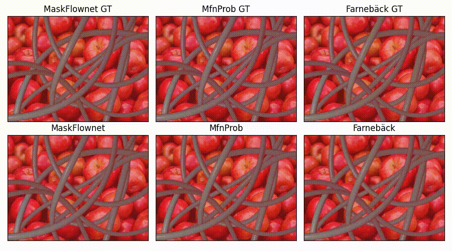
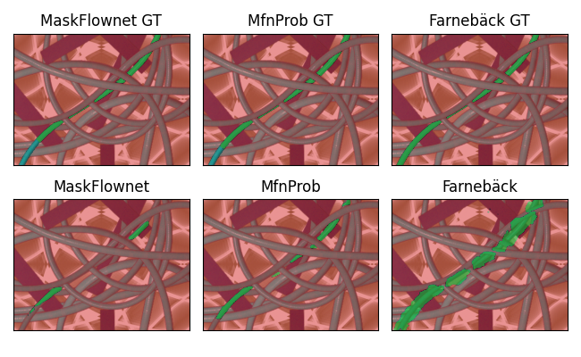
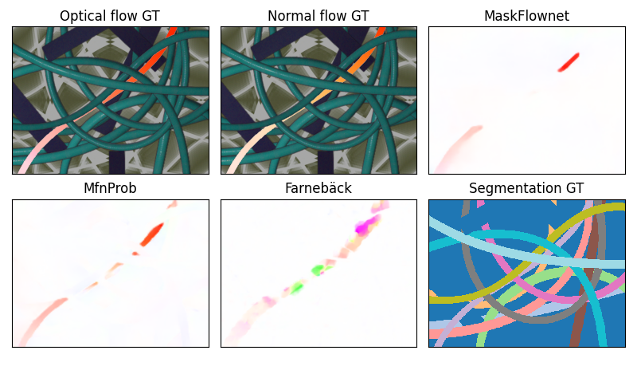

# MovingCables: Moving Cable Segmentation Method and Dataset

By Ondřej Holešovský, Radoslav Škoviera, Václav Hlaváč.

## Table of contents

1. [Introduction](#introduction)
2. [Qualitative motion segmentation results on real-world scenes](#qualitative-motion-segmentation-results-on-real-world-scenes)
3. [Dataset](#dataset)
4. [License](#license)
5. [Evaluation code](#evaluation-code)
    * [Installation](#installation)
    * [Run inference on an image sequence](#run-inference-on-an-image-sequence)
    * [Compute the evaluation results](#compute-the-evaluation-results)
    * [Show the computed quantitative results](#show-the-computed-quantitative-results)
    * [Show or generate qualitative visualizations](#show-or-generate-qualitative-visualizations)
6. [Dataset compositing code](#dataset-compositing-code)
    * [Installation](#installation-2)
    * [Usage](#usage)


## Introduction



Manipulating cluttered cables, hoses or ropes is challenging for both robots and humans. Humans often simplify these perceptually challenging tasks by pulling or pushing tangled cables and observing the resulting motions. We would like to build a similar system -- in accordance with the interactive perception paradigm -- to aid robotic cable manipulation. A cable motion segmentation method that densely labels moving cable image pixels is a key building block of such a system. We present MovingCables, a moving cable dataset, which we hope will motivate the development and evaluation of cable motion (or semantic) segmentation algorithms. The dataset consists of real-world image sequences automatically annotated with ground truth segmentation masks and optical flow. In addition, we propose a cable motion segmentation method and evaluate its performance on the new dataset.

This repository contains:

- The code of MfnProb (MaskFlownetProb), that is [MaskFlownet](https://github.com/microsoft/MaskFlownet/) optical flow predicting neural network with probabilistic outputs added. See the ```MaskFlownet``` directory and ```flow_predictors/online_flow.py```.
- The pretrained weights of MfnProb. (```MaskFlownet/weights/99bMay18-1454_1000000.params```)
- The pretrained weights of MfnProb FT (```MaskFlownet/weights/b1aApr25-1426_320000.params```) and MaskFlownet FT (```MaskFlownet/weights/975Apr26-1614_320000.params```), networks fine-tuned on a mixture of Sintel, KITTI, HD1K, and the MovingCables training set.
- The code to evaluate MfnProb, MaskFlownet, MfnProb FT, MaskFlownet FT, Farnebäck, and optionally GMFlow and FlowFormer++ cable motion segmentation methods on the MovingCables dataset. (```evaluate_all.py```, ```evaluate_single.py```)
- The code to print the quantitative evaluation metrics (```show_stats.py```, ```stats_by_attribute.py```, ```show_stats_per_clip.py```) and to visualize the results (```show_masks.py```, ```render_mask_video.py```, ```show_flow.py```, ```render_flow_video.py```).
- The code to compose a custom dataset from the raw recorded clips. (```compositor```).

## Qualitative motion segmentation results on real-world scenes


https://github.com/holesond/movingcables/assets/6507466/c0e390da-0179-40af-a041-3182e0b82bea


https://github.com/holesond/movingcables/assets/6507466/a1a766d0-396c-4eb1-8761-15dd1f97724e


The (SAM+DINO) method is a semantic segmentation method, not a motion segmentation one. It is a combination of Dino + Segment Anything with the query "rope hose cable".

## Dataset

We provide the composed MovingCables dataset in two packages, full and small. Both packages contain all the 312 composed video clips. The full package contains all the 187187 images (ca. 600 images per clip, 60 FPS). The small package contains ten times fewer images per clip, i.e. ca. 60 images per clip, 6 FPS.

- [MovingCables_full.tar](https://data.ciirc.cvut.cz/public/projects/2024MovingCables/MovingCables_full.tar)
  - size: 114.6 GiB
  - sha256sum: ```ce5841f1d706b5a4e76d85b21b3e9397b7235e3e76250d999eb0d8681368a641```
  - 60 FPS. 600 images per clip.
- [MovingCables_small.tar](https://data.ciirc.cvut.cz/public/projects/2024MovingCables/MovingCables_small.tar)
  - size: 11.5 GiB
  - sha256sum: ```37fae4b64de416ec5f36c1f0c9e2fa2f6c2ac85a76f64be165d97a481d9633c8```
  - 6 FPS. 60 images per clip.
- [MovingCables_sample.tar](https://data.ciirc.cvut.cz/public/projects/2024MovingCables/MovingCables_sample.tar)
  - size: 80.7 MiB
  - sha256sum: ```b0d5fcff8eed3d380f9bb812c0e0ffe7ab25a03e82cfbad6120e46b2552dc45a```
  - This package contains only the clips ```test/0003``` and ```test/0006``` from MovingCables_small.

As a prerequisite for using the dataset with the example commands detailed below, set the ```DATASET_ROOT``` environment variable to the location of the MovingCables dataset. For example on Linux in bash:

```
export DATASET_ROOT="/home/user/datasets/MovingCables"
```

**Data format**

All the composed dataset files are PNG images. They are stored in directories according to the pattern:

```split_name/image_type/clip_number/image_number.png```

- ```split_name``` can be ```test```, ```train```, or ```validation```
- ```image_type``` can be one of:
    - ```flow_first_back``` - ground truth optical flow images
    - ```normal_flow_first_back``` - ground truth normal flow images
    - ```rgb_clips``` - color images
    - ```stick_masks``` - binary images of poking stick segmentation masks
- ```clip_number``` - clip number padded by zeros to four digits, starting from one (0001, 0002, 0003, ...)
- ```image_number``` - image number padded by zeros to eight digits

The published composed dataset contains only odd-numbered images (00000001.png, 00000003.png, ...). These images were captured with the white light turned on. (In a raw recorded sequence, each such white-lit image was preceded and followed by even-numbered UV-lit images (00000000.png, 00000002.png, 00000004.png, ...). The first (00000000.png) and the last image of a raw recorded sequence was always captured with the UV light turned on. These UV-lit images are not in the composed dataset.)

The flow images have three 16-bit channels. The first two channels encode the ground truth optical flow. The third channel stores the ground truth cable instance segmentation label of each pixel. The background label is ```0```, integers greater than zero (```1,2,3,...```) label individual cable instances (```1,2,3,...```). To load the optical flow or normal flow images from the PNG files, one can use function ```load_flow_png_float``` from ```evaluator/evaluator.py```. The key line (in Python) for converting the 16-bit unsigned integer (uint16) values to floating point (float) flow values in pixels is ```flow_float[...,0:2] = (flow_uint16[...,0:2] - 2**15)*(1.0/64.0)```.

To play a dataset clip (a sequence of images) as a video, one can use the [mpv](https://mpv.io/) media player as follows:

```
mpv --keep-open=yes -mf-fps 60 mf://$DATASET_ROOT/sampled_compositions/test/rgb_clips/0006/*.png
```

for the full (60 FPS) dataset version and:

```
mpv --keep-open=yes -mf-fps 6 mf://$DATASET_ROOT/sampled_compositions_small/test/rgb_clips/0006/*.png
```

for the small (6 FPS) dataset version.


**The source dataset**

We also provide the source dataset consisting of the postprocessed recorded clips for generating new compositions. It contains 177 clips with optical and normal flow ground truth and cable and poking stick segmentation masks. The images are RGBA with the alpha channel already generated by chroma key. The source dataset package also contains the background images we used to generate the composed MovingCables dataset above. The [dataset compositing code](#dataset-compositing-code) can sample and create new composite clips from this source dataset.

- MovingCables_src.tar - TODO: Add the link.
  - size: 59.6 GiB
  - sha256sum: 7639c617de58746c0ea1c6ca2c9c8b29fd53bf5c12476aa958dea07bf310c866
  - 60 FPS. 600 images per clip.

The source dataset contains the following folders:

- ```background_images/vga_cc0``` - The VGA background images. They are further divided into clutter and distractors.
- ```flow_first_back``` - Ground truth optical flow images.
- ```normal_flow_first_back``` - Ground truth normal flow images.
- ```rgba_clips``` - RGBA images showing the cables and the poking stick. The alpha channel masks the background.
- ```rgba_clips_stick``` - RGBA images showing the cables and the background. The alpha channel masks the poking stick.
- ```stick_masks``` - Binary images of poking stick segmentation masks.


## License

The MovingCables dataset © 2024 by Ondrej Holesovsky, Radoslav Skoviera, Vaclav Hlavac is licensed under CC BY-SA 4.0. To view a copy of this license, visit http://creativecommons.org/licenses/by-sa/4.0/

The source code in this repository is licensed under the MIT license.


## Evaluation and inference code

We obtained all the reported runtimes on a desktop computer with an NVIDIA GeForce RTX 2080 Ti and Intel Core i9-9900K CPU @ 3.60GHz.


### Installation

Running the code requires [Python](https://www.python.org) version 3.7 or greater installed on your computer. Furthermore, the Python packages listed in ```requirements.txt``` or ```requirements_cuda10.txt``` need to be installed. Use ```requirements_cuda10.txt``` if you want to run MfnProb or MaskFlownet deep networks on a GPU with CUDA 10.1. Otherwise use ```requirements.txt``` for a CPU-only execution.

To install the packages in a new [virtual environment](https://docs.python.org/3/library/venv.html) at ```/home/user/apps/venv/movingcables```, create and activate the environment first:

```
python -m venv /home/user/apps/venv/movingcables
source /home/user/apps/venv/movingcables/bin/activate
```

To install the packages for a CPU-only setup (requires ca. 458 MiB of disk space), run:

```
pip install -r requirements.txt
```

For GPU support (requires CUDA 10.1 and ca. 883 MiB of disk space), run:

```
pip install -r requirements_cuda10.txt
```

Activate the environment before each use in a new terminal by:

```
source /home/user/apps/venv/movingcables/bin/activate
```

Optional: Download [Unimatch](https://github.com/autonomousvision/unimatch) and/or [FlowFormer++](https://github.com/XiaoyuShi97/FlowFormerPlusPlus) Git repos to enable the evaluation of cable motion segmentation methods based on GMFlow and/or FlowFormer++ optical flow predictors. The MovingCables evaluation code expects these repos to reside in the MovingCables code root directory in folders ```unimatch``` and ```FlowFormerPlusPlus```. (We downloaded and tested FlowFormerPlusPlus commit ```c33de90f35af3fac1a55de6eac58036dd8ffb3b3``` and Unimatch commit ```95ffabe53adea0bc33a13de302d827d55c600edd```.) Also install the specific dependencies of Unimatch and/or FlowFormer++.


### Run inference on an image sequence

To run MfnProb motion segmentation with the motion threshold of 2.5 pixels on your own image sequence on a CPU, use:

```
python run_inference.py --mt 2.5 mfnprob /path/to/input/image/sequence/folder /output/folder
```

The input folder should contain only images (typically in PNG or JPEG format) named in such a way that sorting them by the file name yields the correct image sequence. (Zero-padded integers (00000000.png, 00000001.png, 00000002.png, ...) are one such suitable file naming system.)

The program will save the images with overlaid semi-transparent green motion segmentation masks into the output folder.

The help text of ```run_inference.py```:

```
usage: run_inference.py [-h] [-d] [-g] [--mt MOTION_THRESHOLD]
                        method_name folder_rgb folder_out

Run motion segmentation on an image sequence. Save images with overlaid
segmentation masks.

positional arguments:
  method_name           segmentation method name to run (maskflownet,
                        maskflownet_ft, mfnprob, mfnprob_ft, farneback,
                        gmflow, flowformerpp)
  folder_rgb            input RGB(A) clip folder
  folder_out            output folder path

optional arguments:
  -h, --help            show this help message and exit
  -d, --debug           debug mode
  -g, --gpu             run the method on a GPU
  --mt MOTION_THRESHOLD
                        set the flow magnitude segmentation threshold
```

The methods ```maskflownet_ft``` and ```mfnprob_ft``` are MaskFlownet and MfnProb fine-tuned on a mixture of Sintel, KITTI, HD1K, and the MovingCables training set.

### Compute the evaluation results

The following examples evaluate the motion segmentation algorithms (MfnProb, MaskflowNet, Farnebäck) on the small version of the dataset. If you want to run the evaluation on the full dataset, replace ```sampled_compositions_small``` with ```sampled_compositions``` in the paths to the dataset and the results.

Use the ```-g``` option to run MfnProb and/or MaskFlownet on a GPU. If you want to run them on the CPU instead, remove the ```-g``` option from the list of arguments.

The help text of ```evaluate_all.py```:

```
$ python evaluate_all.py -h
usage: evaluate_all.py [-h] [-d] [-g] [-p] [--finetuned] [-s] [-f] [--gmflow]
                       [--flowformerpp] [-o MASK_SAVE_FOLDER]
                       [-of FLOW_SAVE_FOLDER] [--mt MOTION_THRESHOLD]
                       [--no-mui] [-j JOBS]
                       folder_clips folder_stats_out

Evaluate MaskFlownet motion segmentation on multiple clips. Save performance
metrics.

positional arguments:
  folder_clips          input root clip folder
  folder_stats_out      output stats folder

optional arguments:
  -h, --help            show this help message and exit
  -d, --debug           debug mode
  -g, --gpu             run MaskflowNet on GPU
  -p, --probabilistic   run MfnProb
  --finetuned           run MfnProb or MaskFlownet finetuned on MovingCables
  -s, --small           run MaskFlownet_S architecture instead of MaskFlownet
  -f, --farneback       run Farneback's optical flow instead of MaskFlownet
  --gmflow              run GMFlow optical flow instead of MaskFlownet
  --flowformerpp        run FlowFormer++ optical flow instead of MaskFlownet
  -o MASK_SAVE_FOLDER   if set, save computed segmentation masks to the given
                        folder
  -of FLOW_SAVE_FOLDER  if set, save predicted optical flow images to the
                        given folder
  --mt MOTION_THRESHOLD
                        set the flow magnitude segmentation threshold
  --no-mui              disable motion uncertainty IoU (performance)
                        evaluation
  -j JOBS               the number of parallel jobs

```

**Save the quantitative results only**

Evaluate **MfnProb** on the small test set with four parallel evaluation jobs (4 jobs, 5m53s runtime):

```
time python evaluate_all.py -j 4 -g -p --mt 2.0 --no-mui $DATASET_ROOT/sampled_compositions_small/test results/mfnprob/sampled_compositions_small/test
```

Evaluate **MaskflowNet** on the small test set (4 jobs, 5m31s runtime):

```
time python evaluate_all.py -j 4 -g --mt 2.5 --no-mui $DATASET_ROOT/sampled_compositions_small/test results/mfn/sampled_compositions_small/test
```

Evaluate **Farnebäck** on the small test set (8 jobs, 1m44s runtime):

```
time python evaluate_all.py -j 8 -f --mt 1.0 --no-mui $DATASET_ROOT/sampled_compositions_small/test results/farneback/sampled_compositions_small/test
```

**Save both the quantitative and qualitative results**

To run the evaluation of the three methods on the small ```test``` set while also saving the segmentation masks (option ```-o mask_save_folder```) and the optical flow predictions (option ```-of flow_save_folder```), use:

**MfnProb** (4 jobs, 5m58s runtime):

```
time python evaluate_all.py -j 4 -g -p --mt 2.0 --no-mui -o results/mfnprob/sampled_compositions_small/test/masks -of results/mfnprob/sampled_compositions_small/test/normal_flow $DATASET_ROOT/sampled_compositions_small/test results/mfnprob/sampled_compositions_small/test
```

**MaskflowNet** (4 jobs, 5m56s runtime):

```
time python evaluate_all.py -j 4 -g --mt 2.5 --no-mui -o results/mfn/sampled_compositions_small/test/masks -of results/mfn/sampled_compositions_small/test/normal_flow $DATASET_ROOT/sampled_compositions_small/test results/mfn/sampled_compositions_small/test
```

**Farnebäck** (8 jobs, 3m22s runtime):

```
time python evaluate_all.py -j 8 -f --mt 1.0 --no-mui -o results/farneback/sampled_compositions_small/test/masks -of results/farneback/sampled_compositions_small/test/normal_flow $DATASET_ROOT/sampled_compositions_small/test results/farneback/sampled_compositions_small/test
```

Alternatively, one can compute the quantitative results, the segmentation masks (option ```-o mask_save_folder```) and the optical flow predictions (option ```-of flow_save_folder```) for a single clip only. For example for MaskFlownet on clip 0086 of the small training set, run:

```
time python evaluate_single.py -g --mt 2.5 --no-mui -o results/mfn/sampled_compositions_small/train/masks/0086 -of results/mfn/sampled_compositions_small/train/normal_flow/0086  $DATASET_ROOT/sampled_compositions_small/train/rgb_clips/0086 results/mfn/sampled_compositions_small/train/0086.npz
```


### Show the computed quantitative results

The provided code can print the overall evaluation results, results per clip or aggregated by a dataset attribute.

**Overall results**

To show the **overall results** on the small ```test``` set, run:

```
python show_stats.py results/mfnprob/sampled_compositions_small/test
python show_stats.py results/mfn/sampled_compositions_small/test
python show_stats.py results/farneback/sampled_compositions_small/test
```

The expected outputs follow. MfnProb on the small test set:

```
Variable & IoU\\
\midrule
mean & 0.6577\\
median & 0.7207\\
min & 0.0000\\
q0.05 & 0.1394\\
q0.1 & 0.3247\\
q0.2 & 0.5380\\
q0.8 & 0.8282\\
q0.9 & 0.8623\\
q0.95 & 0.8835\\
max & 0.9472\\

Variable & Value\\
\midrule
Recall & 0.8783\\
Precision & 0.7339\\
IoU & 0.6577\\
FP @ $\|\phi _{gt}\| \leq 1$ & 0.2207\\
EPE & 0.6506\\
EPE @ $\|\phi _{gt}\| \leq 1$ & 0.3535\\
EPE @ $\|\phi _{gt}\| > 1$ & 5.1040\\
EPE @ $\|\phi _{p}\| \leq 1$ & 0.1634\\
EPE @ $\|\phi _{p}\| > 1$ & 6.2066\\
Ground truth moving share & 0.0370\\
Ground truth static share & 0.9552\\
```

MaskFlownet on the small test set:

```
Variable & IoU\\
\midrule
mean & 0.4072\\
median & 0.4229\\
min & 0.0000\\
q0.05 & 0.0000\\
q0.1 & 0.0751\\
q0.2 & 0.1618\\
q0.8 & 0.6304\\
q0.9 & 0.7323\\
q0.95 & 0.7748\\
max & 0.8874\\

Variable & Value\\
\midrule
Recall & 0.6092\\
Precision & 0.6401\\
IoU & 0.4072\\
FP @ $\|\phi _{gt}\| \leq 1$ & 0.3315\\
EPE & 1.2095\\
EPE @ $\|\phi _{gt}\| \leq 1$ & 0.7884\\
EPE @ $\|\phi _{gt}\| > 1$ & 7.6765\\
EPE @ $\|\phi _{p}\| \leq 1$ & 0.3450\\
EPE @ $\|\phi _{p}\| > 1$ & 9.5174\\
Ground truth moving share & 0.0353\\
Ground truth static share & 0.9552\\
```

Farnebäck on the small test set:

```
Variable & IoU\\
\midrule
mean & 0.3343\\
median & 0.3421\\
min & 0.0000\\
q0.05 & 0.1278\\
q0.1 & 0.1933\\
q0.2 & 0.2490\\
q0.8 & 0.4344\\
q0.9 & 0.4758\\
q0.95 & 0.5087\\
max & 0.6501\\

Variable & Value\\
\midrule
Recall & 0.8953\\
Precision & 0.3527\\
IoU & 0.3343\\
FP @ $\|\phi _{gt}\| \leq 1$ & 0.6473\\
EPE & 1.5461\\
EPE @ $\|\phi _{gt}\| \leq 1$ & 1.0602\\
EPE @ $\|\phi _{gt}\| > 1$ & 8.4677\\
EPE @ $\|\phi _{p}\| \leq 1$ & 0.1538\\
EPE @ $\|\phi _{p}\| > 1$ & 11.8837\\
Ground truth moving share & 0.0448\\
Ground truth static share & 0.9552\\
```

**Per-clip results**

To show the **statistics of per-clip IoUs** on the ```test``` set, run:

```
python show_stats_per_clip.py results/mfnprob/sampled_compositions_small/test
python show_stats_per_clip.py results/mfn/sampled_compositions_small/test
python show_stats_per_clip.py results/farneback/sampled_compositions_small/test
```

Expected output for MfnProb (i.e. the first command):

```
Variable & IoU\\
\midrule
mean & 0.6595\\
median & 0.6924\\
MAD & 0.1098\\
min & 0.1068\\
q0.05 & 0.3719\\
q0.1 & 0.4790\\
q0.2 & 0.5680\\
q0.8 & 0.7816\\
q0.9 & 0.8030\\
q0.95 & 0.8401\\
max & 0.8919\\
Min. IoU at results/mfnprob/sampled_compositions_small/test/0047.npz.
Max. IoU at results/mfnprob/sampled_compositions_small/test/0070.npz.
sorted IoUs:
[0.1068 0.1345 0.1541 0.2074 0.214  0.3642 0.4159 0.417  0.4303 0.4627
 0.4781 0.4812 0.5005 0.5052 0.5155 0.5203 0.5255 0.5348 0.5411 0.5545
 0.5655 0.5696 0.5707 0.5773 0.5959 0.5989 0.602  0.6149 0.6175 0.6294
 0.6301 0.6317 0.6343 0.6367 0.6406 0.646  0.6551 0.6573 0.6607 0.6622
 0.6647 0.6679 0.6687 0.6709 0.6737 0.6745 0.6767 0.6834 0.6846 0.6851
 0.6868 0.6894 0.6955 0.6974 0.6974 0.7033 0.7095 0.7103 0.7107 0.712
 0.7122 0.7149 0.7186 0.7222 0.7225 0.7257 0.7334 0.7353 0.7412 0.7428
 0.7429 0.745  0.7502 0.7539 0.7583 0.7629 0.7629 0.7685 0.7695 0.7715
 0.7746 0.7779 0.7814 0.782  0.7827 0.7843 0.7852 0.7923 0.7929 0.7934
 0.7972 0.8013 0.8017 0.8035 0.8088 0.8215 0.8325 0.8365 0.8408 0.8428
 0.8444 0.8711 0.875  0.8919]
clip indices sorted by IoUs:
[ 46  79  78  35  52  45  73  63  82  59  96  60  88  30  41  39  27  77
  83  47   4  75  67 100   6   5  99  95  86  13   3  42  74  14  40  76
  44   1  64  38  56  37  65  50  98  33  89  29  94  36  71  49 103  85
  66  72  16  87  90  22  48 102  70  58  68  28  80  97  81  15   8  53
  91  19  18 101  20  92  31  54  62  57  43  93  12  10  84  61  51  34
   0  17  25  24   9   7  55  11  23  26   2  32  21  69]
Top five: [26  2 32 21 69]
Bottom five: [46 79 78 35 52]
```

**Results by dataset attribute**

To show the **statistics aggregated by an attribute** (here ```background_class```, but it can also be ```cable_density```, ```motion_type```, ```cable_color```) on the ```test``` set, run:

```
python stats_by_attribute.py test background_class compositor/sampled_compositions.json results/mfnprob/sampled_compositions_small/test
python stats_by_attribute.py test background_class compositor/sampled_compositions.json results/mfn/sampled_compositions_small/test
python stats_by_attribute.py test background_class compositor/sampled_compositions.json results/farneback/sampled_compositions_small/test
```

Expected output for MfnProb (the first command):

```
==== Means ====
Variable & clutter & distractor & plain_\\
\midrule
Recall & 0.8637 & 0.8790 & 0.9063\\
Precision & 0.7834 & 0.7994 & 0.5719\\
IoU & 0.6925 & 0.7169 & 0.5309\\
FP @ $\|\phi _{gt}\| \leq 1$ & 0.1649 & 0.1510 & 0.3995\\
EPE & 0.4846 & 0.4212 & 1.2123\\
EPE @ $\|\phi _{gt}\| \leq 1$ & 0.1927 & 0.1493 & 0.8817\\
EPE @ $\|\phi _{gt}\| > 1$ & 4.9923 & 4.5941 & 5.8351\\
EPE @ $\|\phi _{p}\| \leq 1$ & 0.1402 & 0.1036 & 0.2824\\
EPE @ $\|\phi _{p}\| > 1$ & 6.4770 & 5.6488 & 6.2228\\
Ground truth moving share & 0.0335 & 0.0396 & 0.0413\\
Ground truth static share & 0.9580 & 0.9526 & 0.9522\\
```

### Show or generate qualitative visualizations

The provided code can show images of motion segmentation masks or optical flow. It can also render segmentation or flow videos. Qualitative results can be generated in two steps. First, compute the required qualitative outputs using the ```evaluate_single.py``` or ```evaluate_all.py``` scripts with the ```-o``` and/or ```-of``` options set (see section Compute the evaluation results above). Second, show or render the visualizations (segmentation images or videos, optical flow images or videos).


**Show segmentation images**

Show the motion segmentation masks found by all three methods for frame 381 of clip 0006 from the small test set:

```
python3 show_masks.py $DATASET_ROOT/sampled_compositions_small/test/rgb_clips/0006/00000381.png results/mfn/sampled_compositions_small/test/masks/0006/00000381.png results/mfnprob/sampled_compositions_small/test/masks/0006/00000381.png results/farneback/sampled_compositions_small/test/masks/0006/00000381.png
```



The images with the GT label in the top row show the ground truth segmentation, the images in the bottom row show the predictions of the methods. The ground truth may slightly differ among different methods because each method uses its own optimal motion threshold (optical flow magnitude threshold).


**Render videos showing the segmentations**

Render a video showing motion segmentation masks found by all three methods for clip 0006 from the small test set (runtime 27s):

```
time python3 render_mask_video.py videos/test-0006-seg.mp4 $DATASET_ROOT/sampled_compositions_small/test/rgb_clips/0006 results/mfn/sampled_compositions_small/test/masks/0006 results/mfnprob/sampled_compositions_small/test/masks/0006 results/farneback/sampled_compositions_small/test/masks/0006
```

https://github.com/holesond/movingcables/assets/6507466/39ab84f5-5482-4177-adc2-03449bcab0c9


The same video rendered for test clip 0003 (with a moving poking stick):

https://github.com/holesond/movingcables/assets/6507466/f44e86f3-b6ea-471d-936d-c3bf7f9dd678


**Show optical flow images**

Show the ground truth optical and normal flow, the ground truth instance segmentation and the (normal) optical flow predicted by all three methods for frame 381 of clip 0006 from the small test set:

```
python3 show_flow.py $DATASET_ROOT/sampled_compositions_small/test/rgb_clips/0006/00000381.png -e results/mfn/sampled_compositions_small/test/normal_flow/0006/00000381.png -e results/mfnprob/sampled_compositions_small/test/normal_flow/0006/00000381.png -e results/farneback/sampled_compositions_small/test/normal_flow/0006/00000381.png
```



**Render optical flow visualization videos**

Render a video showing the ground truth optical and normal flow, the ground truth instance segmentation and the (normal) optical flow found by all three methods for clip 0006 from the small test set (runtime 26s):

```
time python3 render_flow_video.py videos/test-0006-flow.mp4 $DATASET_ROOT/sampled_compositions_small/test/rgb_clips/0006 -e results/mfn/sampled_compositions_small/test/normal_flow/0006 -e results/mfnprob/sampled_compositions_small/test/normal_flow/0006 -e results/farneback/sampled_compositions_small/test/normal_flow/0006
```

https://github.com/holesond/movingcables/assets/6507466/01d89133-86b7-47db-a5de-95bf430afb27


The same video rendered for test clip 0003 (with a moving poking stick):

https://github.com/holesond/movingcables/assets/6507466/da35ce1f-98c7-4c17-92cb-52ee9b2f77e2


## Dataset compositing code

The dataset compositing Python code is independent from the evaluation code. It is in the ```compositor``` folder.

The compositing code can create (custom) compositions from the source dataset clips and a set of background images.

We obtained all the reported runtimes on a desktop computer with an NVIDIA GeForce RTX 2080 Ti and Intel Core i9-9900K CPU @ 3.60GHz.

### <a name="installation-2"></a> Installation

The compositing code uses a modified Noise2NoiseFlow software package to generate artificial image sensor noise. The Noise2NoiseFlow package needs to be present in the root folder of the MovingCables source code package. One can download it from https://github.com/holesond/Noise2NoiseFlow:

```
git clone https://github.com/holesond/Noise2NoiseFlow.git
```

One may use the same virtual environment as for the evaluation code. The file ```compositor/requirements_compositor.txt``` lists the required packages to be installed.

```
source /home/user/apps/venv/movingcables/bin/activate
pip install -r compositor/requirements_compositor.txt
```

### Usage

Run the code from the ```compositor``` folder:

```
cd compositor
```

The code performs the compositing in two steps:

1. Given a compositing recipe, the list of recorded clips, and the lists of clutter and distractor background images, sample the configuration of the composed clips to be generated later (```sampled_compositions.json```). See ```sample_dataset_config.py```. Note that one can also create a custom ```sampled_compositions.json``` manually.
2. Do the actual image compositing given ```sampled_compositions.json``` and the recorded clips. See ```compositor.py```.

**To (re)sample the configuration of MovingCables, run:**

```
python sample_dataset_config.py compositing_recipe.json recorded_clips.csv vga_cc0_clutter.txt vga_cc0_distractors.txt sampled_compositions.json
```

Note that the ```sampled_compositions.json``` file for the composed MovingCables dataset is already included in this code package, therefore the resampling is not needed to obtain it. However, one can use the same script to sample a different dataset configuration with a different compositing recipe or background images.

Please note that the code uses fixed random seeds for reproducibility (see ```dataset_samplers.py```).

**To compose the clips specified in the ```sampled_compositions.json``` file, run:**

```
export DATASET_ROOT="/home/user/datasets/MovingCables"
python compositor.py sampled_compositions.json $DATASET_ROOT /composed/dataset/output/folder
```

The first ```export``` command sets the ```DATASET_ROOT``` environment variable to the location of the MovingCables (source) dataset.

This command took ca. 6.5 hours to create MovingCables_full. It runs (up to) eight workers (processes) in parallel by default.

To play a clip (a sequence of images) as a video, one can use the [mpv](https://mpv.io/) media player as follows:

```
mpv --keep-open=yes -mf-fps 60 mf:///composed/dataset/output/folder/test/rgb_clips/0001/*.png
```


